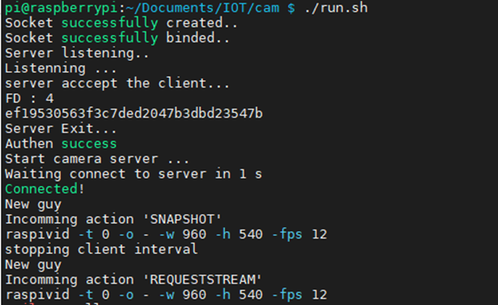
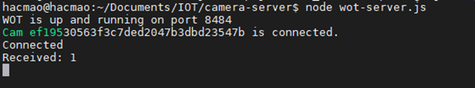
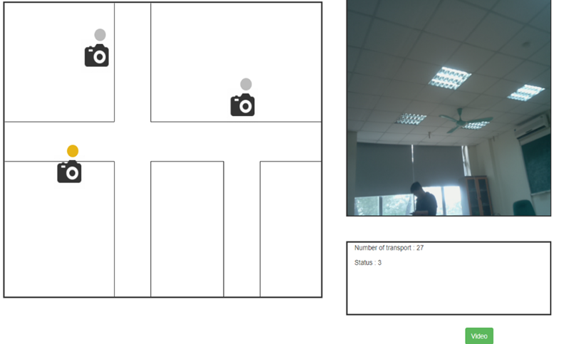
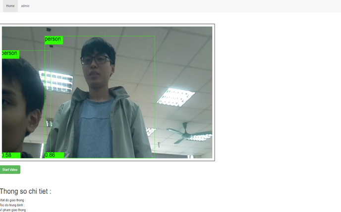

# IOT-smart-traffic

Hệ thống giao thông thông minh dùng camera + rasberry Pi truyền luồng stream qua websocket tới server Nodejs, thực hiện các thuật toán ML để xử lí luồng stream. 

Hệ thống đã xây dựng hiện tại bao gồm những chức năng chính như sau :  
 + Giả lập giao thức xác thực của camera bằng token dựa trên kết nối tcp tới port 8888 và 9999 trên camera. Đồng thời, thiết kế lỗ hổng bảo mật phục vụ mục đích học tập.
 + Giả lập truyền tải thông tin về xe cộ và hiển thị lên web thông qua giao thức MQTT.
 + Stream video bằng websocket vs Wsavcplayer để decode, đồng thời dùng coco-ssd để detect vật thể. (Xem thêm file `public/vendor/dist/http-live-player.js` hàm `detectFromVideoFrame`).

## Demo

